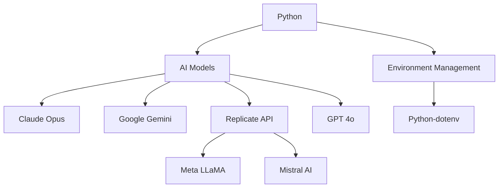
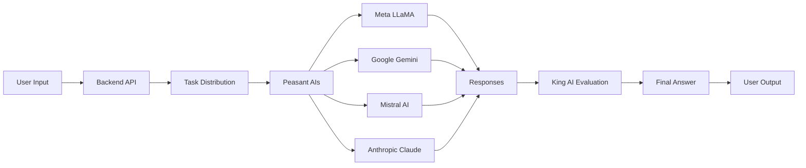
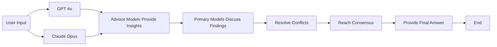

# MoM

Harness the collective intelligence of multiple large language models (LLMs) to enhance decision-making and problem-solving capabilities in complex scenarios. 

## What do we hope to achieve with the integration of diverse AI model outputs?

- Synthesize responses from various LLMs
- To improve decision frameworks.
- Construct and rigorously test two collaborative architectures

## Technology Stack

| Technology | Description |
| --- | --- |
| Python | Programming language used for backend and AI integration. |
| Anthropic Claude | One of the LLMs used for generating insights. |
| Google Gemini | Another LLM used for generating insights. |
| Meta LLaMA | An LLM used for generating insights. |
| Mistral AI | An LLM used for generating insights. |
| OpenAI API | API for accessing OpenAI's GPT models. |
| Replicate API | API for accessing various AI models and tools. |
| Python-dotenv | Read key-value pairs from a .env file and set them as environment variables. |

## King Data Flow

## Duopoly Data Flow

